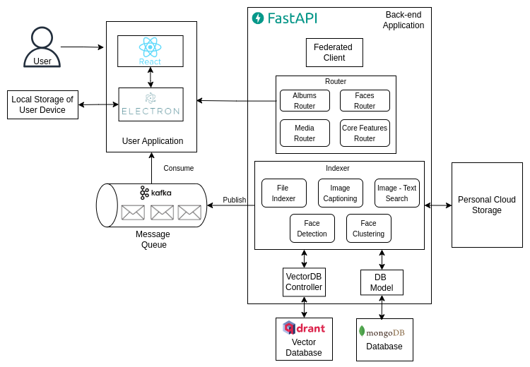

# PicsSmart-Core

This component contains the core backend service of the **PicsSmart** application. This can be run as a standalone service in the client machine.

## Application Architecture

The Application Architecture is illustrated in the below diagram.



## Deploying

### Clone the repository

```bash
git clone https://github.com/PicsSmart/picssmart-core.git
```

### Prerequisites

- Conda
- Docker

### Install the dependencies and enabling services

```bash
./setup-env.sh <conda-env-name>
```

> You may define the name of the conda environment you want to create.

- With this script, all the dependencies will be installed and below required services will be up and running as docker containers.
    - MongoDB
    - Mongo Express (Optional)
    - Qdrant Vector Database
    - Kafka Broker
    - Zookeeper

### How to run the server

- Add a `.env` file as in below format inside the `server` folder

```.env
mongo_db_host = "localhost"
mongo_db_port = 27017
mongo_db_user = "picssmartadmin"
mongo_db_password = "picssmartpw"
mongo_db_database = "picssmart"
mongo_db_auth = "admin"

qdrant_host="localhost"
qdrant_port=6333
qdrant_collection="picssmart"

server_address_federated="127.0.0.1:8080" # Address of the federated server
```
- After that server can be run using below command

```bash
uvicorn server.__main__:create_app --factory --reload
```

## Clean DB entries
- To clean the database entries, run the below command
```bash
python clean.py
```